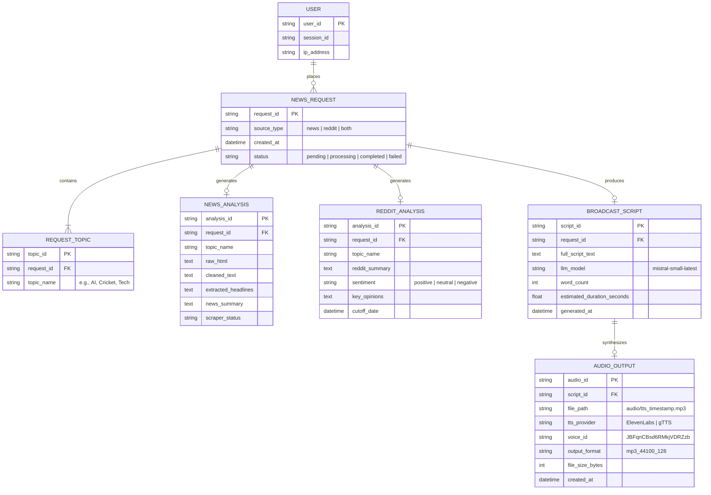

# Personal AI Journalist: Case Study

**Turn the news into a short audio briefing on any topic you pick.**

[Live demo](https://personal-ai-journalist.streamlit.app/) | [Source code](https://github.com/HamzaAmir1470/Personal-AI-Journalist)

| | |
|---|---|
| **Role** | Solo developer (design, backend, frontend, deployment) |
| **Frontend** | Streamlit, deployed on Streamlit Community Cloud |
| **Backend** | FastAPI (Python) |
| **AI summary** | Mistral AI |
| **Voice** | ElevenLabs text to speech |
| **Data sources** | Reddit and Google News |

---

## 1. Overview

Personal AI Journalist is an agent that finds news for you, writes a summary, and reads it out loud.

You type up to three topics. You choose where the agent looks: Google News, Reddit, or both. A few moments later, you get a spoken news briefing you can play in the browser.

The project joins four jobs into one flow: **scrape, summarize, speak, and serve.**

---

## 2. The Problem

Staying informed takes time. A person who wants the latest on a topic has to:

1. Open several sites.
2. Skim many headlines.
3. Read long articles to find the useful parts.
4. Check Reddit to see what people actually say about the story.

News sites show you the official story. Reddit shows you the public reaction. Reading both for three topics can eat half an hour.

Many people also want to listen instead of read. They want news while they walk, cook, or commute.

**The goal:** give a user a single place where they type a topic and get back a short audio briefing built from both professional news and community discussion.

---

## 3. The Solution

I built an AI agent with a simple promise: pick your topics, press a button, and listen.

The agent does the reading for you. It collects fresh headlines from Google News and trending posts from Reddit. It sends that material to Mistral AI, which writes a clean summary. It then sends the summary to ElevenLabs, which turns the text into natural speech. The frontend returns the audio as an MP3 file.

### Key features

- **Up to 3 topics per request.** Users can cover several interests in one briefing.
- **Source control.** Users pick `news`, `reddit`, or `both`.
- **Two kinds of voice in one summary.** Reporters give the facts. Reddit gives the reaction.
- **Audio output.** The result plays right in the browser as an MP3.
- **Clean web interface.** A black sidebar holds the controls. A white main screen shows the result. A blue banner carries the brand.

---

## 4. How It Works

The system has two parts that talk over HTTP: a Streamlit frontend and a FastAPI backend.

```
   User
     |
     |  topics (max 3) + source type (news / reddit / both)
     v
+--------------------+
|  Streamlit app     |   Frontend, deployed on Streamlit
+--------------------+
     |
     |  POST /generate-news-audio
     v
+--------------------+
|  FastAPI backend   |
|                    |
|  1. Scrape         |---> Google News
|                    |---> Reddit
|  2. Summarize      |---> Mistral AI
|  3. Voice          |---> ElevenLabs
+--------------------+
     |
     |  MP3 audio
     v
  Browser audio player
```

### Step by step

1. **The user submits a request.** The Streamlit app collects the topics and the source type.
2. **The frontend calls the API.** It sends a `POST` request to the `/generate-news-audio` endpoint on the FastAPI backend.
3. **The agent scrapes the sources.** For each topic, the backend pulls headlines and article details from Google News and posts from Reddit. The source type decides which of the two it uses.
4. **Mistral AI writes the summary.** The backend sends the collected text to Mistral AI with instructions to write a short briefing that sounds natural when spoken.
5. **ElevenLabs creates the audio.** The summary goes to ElevenLabs, which returns speech.
6. **The backend returns the MP3.** The frontend receives the file and plays it.

---

## 5. Tech Stack and Why I Chose It

| Layer | Tool | Why |
|---|---|---|
| Frontend | **Streamlit** | It turns Python into a working web interface fast. It also deploys with very little setup. |
| Backend | **FastAPI** | It is quick, simple to read, and handles request validation well. It keeps the AI logic apart from the interface. |
| Summarization | **Mistral AI** | It writes clear summaries from messy input and gives good results for the cost. |
| Text to speech | **ElevenLabs** | Its voices sound natural, which matters when the whole product is audio. |
| News data | **Google News and Reddit** | One source gives professional reporting. The other gives real public opinion. |

### Why a separate backend?

I could have put everything inside the Streamlit app. I split the project in two for three reasons:

- **Clean structure.** The interface only handles input and playback. The backend handles scraping and AI work.
- **Safe keys.** The Mistral and ElevenLabs API keys stay on the server. The frontend never sees them.
- **Room to grow.** Another client, such as a mobile app or a browser extension, can call the same API later.

---

## 6. Design Decisions

### Two sources instead of one

News sites report what happened. Reddit shows how people feel about it. Combining them gives a briefing with more depth than a plain headline read. The `both` option makes this the default experience, and users can switch to a single source when they want one.

### A cap of three topics

Each topic adds scraping time, summarization cost, and audio length. Three topics keep the wait short and the briefing easy to listen to. It also keeps API costs under control.

### Writing for the ear

A summary meant to be read looks different from one meant to be heard. Listeners cannot skim or scroll back. I shaped the Mistral prompt to produce short sentences and a clear order, so the audio is easy to follow.

### A focused interface

The UI has one job, so it has few controls: a topic input, a source selector, and a generate button. The black sidebar and white main screen make the controls and the result easy to tell apart.

---

## 7. Challenges and How I Solved Them

> **Note:** Edit this section so it matches your real experience. Replace or add to the items below with the problems you actually faced.

**Challenge 1: Turning scraped text into a good script.**
Raw headlines and Reddit comments are noisy. Reddit posts include slang, repeated points, and off-topic replies. I solved this by filtering the input and giving Mistral clear instructions about length, tone, and structure.

**Challenge 2: Wait time.**
Scraping, summarizing, and voice generation all take time, and they run in sequence. The interface shows a loading state so the user knows work is in progress.

**Challenge 3: Connecting two deployments.**
The frontend and backend live in different places. I had to handle the API URL, request format, and returned audio file so the two sides work together smoothly.

**Challenge 4: Keeping secrets safe.**
The project uses paid API keys. I stored them as environment variables and kept them out of the repository.

---

## 8. Result

Personal AI Journalist works end to end and runs live on the web.

- A user can go from an idea to an audio briefing in one click.
- The agent combines two very different data sources into one summary.
- The frontend and backend stay cleanly separated, so each can change without breaking the other.

---

## 9. What I Learned

- How to design an **agent flow** that chains scraping, language models, and speech into one pipeline.
- How to **prompt a model for spoken output**, not written output.
- How to build a **FastAPI service** that returns binary audio.
- How to **deploy and connect** a Streamlit frontend with a separate API.
- How to manage **API keys and external service limits** in a real project.

---

## 10. Future Improvements

- Add more sources, such as RSS feeds or X.
- Let users choose the voice and the briefing length.
- Add language support for non-English news.
- Cache results so repeat topics return faster.
- Add a daily briefing that arrives on a schedule.
- Add source links under each summary so users can read the full stories.

---

## 11. Run It Yourself

```bash
# Clone the repository
git clone https://github.com/HamzaAmir1470/Personal-AI-Journalist.git
cd Personal-AI-Journalist

# Install dependencies
pip install -r requirements.txt

# Add your keys to a .env file
# MISTRAL_API_KEY=your_key
# ELEVENLABS_API_KEY=your_key

# Start the backend
uvicorn main:app --reload

# Start the frontend (in a second terminal)
streamlit run app.py
```

> **Note:** Check the file names (`main.py`, `app.py`) and the environment variable names against your repository and adjust them if they differ.

---

## 12. Links

- **Live app:** https://personal-ai-journalist.streamlit.app/
- **GitHub:** https://github.com/HamzaAmir1470/Personal-AI-Journalist
- **Author:** [Hamza Amir](https://github.com/HamzaAmir1470)



